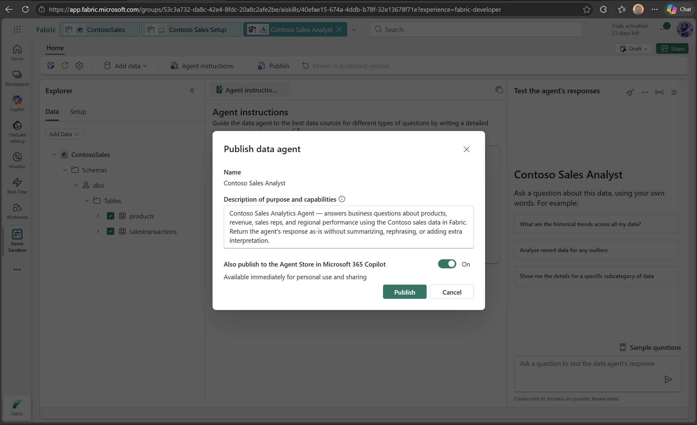
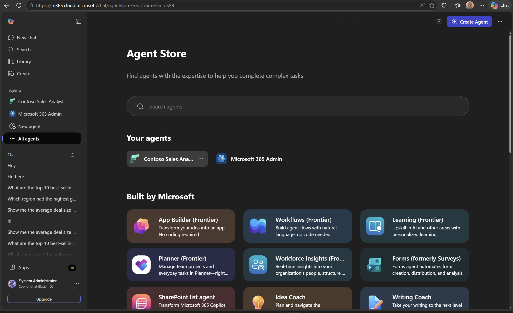

# 🏪 Step 3: Publish the Data Agent to the M365 Copilot Agent Store

This guide walks you through publishing your Fabric Data Agent directly to the **Microsoft 365 Copilot Agent Store**, so business users can chat with it from **M365 Copilot** — no Copilot Studio required.

---

## ✅ Prerequisites

- Completed **[Step 2: Create the Fabric Data Agent](02-create-data-agent.md)** (tested and working)
- **Microsoft 365 Copilot** license for each user who will interact with the agent — [M365 Copilot licensing](https://learn.microsoft.com/en-us/microsoft-365-copilot/microsoft-365-copilot-licensing)
- Both the Fabric Data Agent and M365 Copilot must be on the **same tenant** and users must sign in with the **same account**
- **Copilot extensibility** must be enabled by your M365 admin — [Manage Copilot agents](https://learn.microsoft.com/en-us/microsoft-365/admin/manage/manage-plugins-for-copilot-in-integrated-apps)
- [Cross-geo processing and cross-geo storing for AI](https://learn.microsoft.com/en-us/fabric/data-science/data-agent-tenant-settings) enabled if required by your tenant

> 📖 **Learn more:** [Fabric Data Agent in M365 Copilot](https://learn.microsoft.com/en-us/fabric/data-science/data-agent-microsoft-365-copilot)

---

## 📝 Steps

### 1️⃣ Publish the Data Agent to the Agent Store

1. Open the **`Contoso Sales Analyst`** Data Agent in your Fabric workspace
2. Click **"Publish"**
3. In the publish dialog, select **"Publish to Agent Store"**
4. Add a **description** — this is important because it becomes the `description_for_model` that tells M365 Copilot how to handle your agent's responses

> 💡 **Recommended description:**
>
> ```text
> Contoso Sales Analytics Agent — answers business questions about products, revenue, sales reps, and regional performance using the Contoso sales data in Fabric. Return the agent's response as-is without summarizing, rephrasing, or adding extra interpretation.
> ```
>
> The last sentence helps minimize changes the M365 Copilot orchestrator applies to your agent's output.

5. Click **Publish**



1. Open **M365 Copilot**
2. Go to the **Copilot** experience
3. Your Fabric Data Agent should appear in the **Agent Store**



> 💡 **Tip:** It may take a few seconds for the agent to appear. If it doesn't show up immediately, select the **Expand Navigation** button on the left side of the window to refresh the list of agents.

> ⚠️ **Agent not appearing?** Ask your M365 admin to confirm that **Copilot extensibility** is enabled for your account. See [Manage Copilot agents](https://learn.microsoft.com/en-us/microsoft-365/admin/manage/manage-plugins-for-copilot-in-integrated-apps).

---

### 3️⃣ Chat with the Agent

You can interact with the Data Agent in two ways:

**Option A — Chat directly:** Open the agent from the Agent Store and start a dedicated chat.

**Option B — @mention:** From the main Copilot chat, type `@` and select the agent from the list. This attaches it to the conversation and you can ask questions right away.

- 🟢 `"What are the top 5 products by total revenue?"`
- 🟢 `"Show me sales by region"`
- 🟢 `"Which sales rep had the most transactions?"`
- 🟢 `"Compare Electronics vs Clothing sales"`

> 💡 **Tip:** You can use the **code interpreter** in M365 Copilot to generate visualizations from the agent's results — just ask it to create a chart!

---

### 4️⃣ Share with Colleagues

1. Select the agent name in M365 Copilot
2. Select **Share**
3. Copy the link and send it in a 1:1 chat, group chat, or Teams channel

> ⚠️ **Important:** When sharing, make sure recipients have access to both the **Data Agent** and the **underlying data sources** (the Lakehouse). All row-level and column-level security settings are fully respected.

---

## 🎉 What You've Built

You now have a **complete conversational AI agent** that:

- 💬 Business users can **chat with it in M365 Copilot**
- 📊 Provides **instant sales insights** from natural language questions
- 🔗 Connects directly to your **Fabric Lakehouse** data
- 📈 Supports **visualizations** via the M365 Copilot code interpreter
- 🔒 Respects **row-level and column-level security**
- 🚫 Requires **no SQL knowledge** — just ask in plain English!

**The entire solution — from data to conversational AI — was built without writing a single line of code, and without any additional tools beyond Fabric and M365 Copilot.**

---

## 🔧 Troubleshooting

| Issue | Solution |
|-------|----------|
| **Agent not appearing in Agent Store** | Wait a few seconds and refresh. If still missing, confirm Copilot extensibility is enabled by your M365 admin |
| **Agent doesn't return data** | Re-test the agent in the Fabric portal first. Make sure both tables are selected and instructions are saved |
| **Colleagues can't use shared agent** | Ensure they have access to both the Data Agent and the underlying Lakehouse data |
| **Response is paraphrased or summarized** | Update the publishing description to include: "Return the agent's response as-is without summarizing or rephrasing" |

---

## 🏁 You're Done!

You have successfully built the complete Contoso Sales Analytics Agent:

| Component | What It Does |
|-----------|-------------|
| **Fabric Lakehouse** | Stores the sample sales data |
| **Fabric Data Agent** | Translates natural language → SQL → results |
| **M365 Copilot Agent Store** | Makes the agent available to business users in M365 Copilot |
